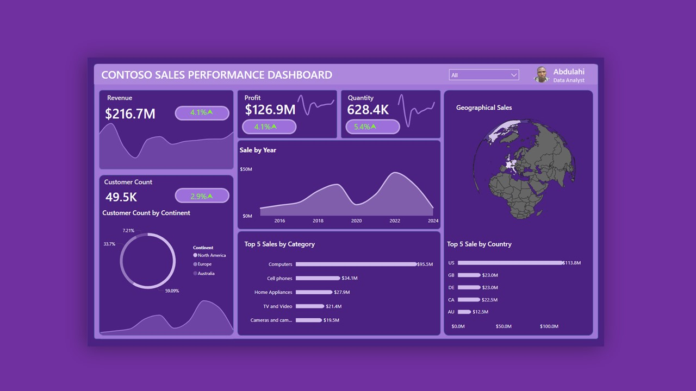

# Contoso Sales Performance Analysis (PostgreSQL)

## Overview
This project analyzes Contoso’s global sales data store in PostgreSQL to produce business-ready metrics and insights.  
The output feeds a sales performance dashboard covering revenue, profit, quantity sold, customer distribution, product performance, and geographical trends.

---

## Objective
Provide a single source of truth for Contoso’s sales performance by answering:
- How much revenue and profit is the business generating?
- How are sales trending over time?
- Which product categories and countries drive the most revenue?
- How are customers distributed geographically?

The analysis is designed to support executive and commercial decision-making.

---

## Dataset
**Contoso Sales Dataset**

The dataset follows a star schema and contains transactional sales data with supporting dimensions.

### Fact Table
- `fact_sales`
  - `sales_amount`
  - `profit`
  - `quantity`
  - `order_date_key`
  - `customer_key`
  - `product_key`

### Dimension Tables
- `dim_customer`
- `dim_product`
- `dim_date`

---

## Data Model
The project uses a star schema to enable fast aggregation and slicing.

- Central fact table: `fact_sales`
- Dimensions connected via surrogate keys
- Optimized for time-series, category, and customer analysis

This structure aligns with BI tools such as Power BI.

---

## Key Metrics
- Total Revenue
- Total Profit
- Total Quantity Sold
- Total Customers
- Year-over-Year Revenue Trend
- Sales by Product Category
- Sales by Country
- Customer Distribution by Continent

---

## Dashboard

### Visuals Included

* KPI cards: Revenue, Profit, Quantity, Customers
* Line chart: Sales by Year
* Bar charts: Top Categories and Top Countries
* Donut chart: Customer Distribution by Continent
* Shape Map: Geographical Sales Performance

---

## Insights

* Revenue shows long-term growth with a noticeable peak followed by decline.
* A small number of product categories account for the majority of sales.
* North America contributes the largest share of revenue.
* Customer distribution is uneven across continents.

---

## Limitations

* Historical data only; no real-time ingestion.
* No forecasting or predictive analysis.
* Manual refresh required for dashboard updates.

---

## Tools Used

* PostgreSQL
* Power Query
* Data Modeling
* DAX syntax
* Power BI (visualization)

---

## Use Case

This project demonstrates:

* Business-focused SQL analysis
* Dimensional data modeling
* KPI-driven dashboards
* Analytics engineering fundamentals

